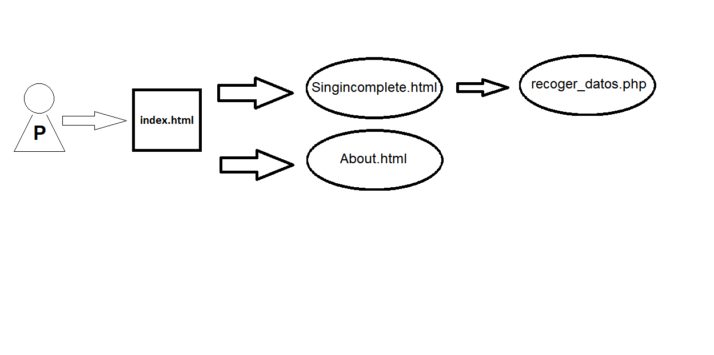

# proyectoObjetos

## Proyecto: Introducción al desarrollo de aplicaciones orientadas a objectos.

`Creado por` Jerónimo Ballesta

`Profesor` Eric Casanova

`Subvencionado por` CESI

```
Máquinas trabajando! Seguimos en producción.
Disculpen las molestias.
Mejoraremos la web día a día.

```

---

[easyfruity.tk](easyfruity.tk)


---

Hola! Soy Jero!
<br>
Bienvenid@

[♠Github] (https://github.com/HeroXBow/proyectoObjetos)

[EasyFruity, from earth to your home](http://www.easyfruity.tk/)

He creado un proyecto en HTML + CSS para el curso <b>Introducción al desarrollo de aplicaciones orientadas a objectos</b>.

En dicha url realizamos una conexión entre agricultores y clientes finales, donde el producto llega de la tierra a tu casa, sin intermediarios ni exceso de kms para la adecuada conservación del producto.

Con esta iniciativa, intentamos cambiar el modo de compra del cliente final, para evitar que millones de toneladas de alimentos terminen en los basureros.

Una alternativa para empezar un ciclo: podría ser construir tu propio huerto en casa: [Farmbot](https://farm.bot/)

---

`Diagrama UML`


